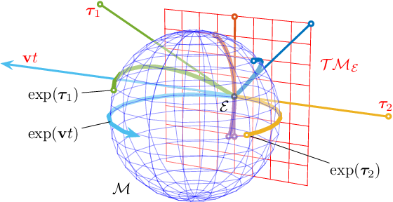

# np_lie
Simple implementation of SO3 and SE3 Lie Group operations in numpy.

Based on [A Micro Lie Theory for State Estimation in Robotics by Joan Sola](https://arxiv.org/pdf/1812.01537.pdf).



Run tests:
```
$ python3 test.py
[PASSED] SO3 vee inverts hat
[PASSED] SO3 log inverts exp
[PASSED] SO3 Log inverts Exp
[PASSED] SO3 left jacobians invert
[PASSED] SE3 vee inverts hat
[PASSED] SE3 log inverts exp
[PASSED] SE3 Log inverts Exp
[PASSED] S3 exp matches SO3 exp
```
